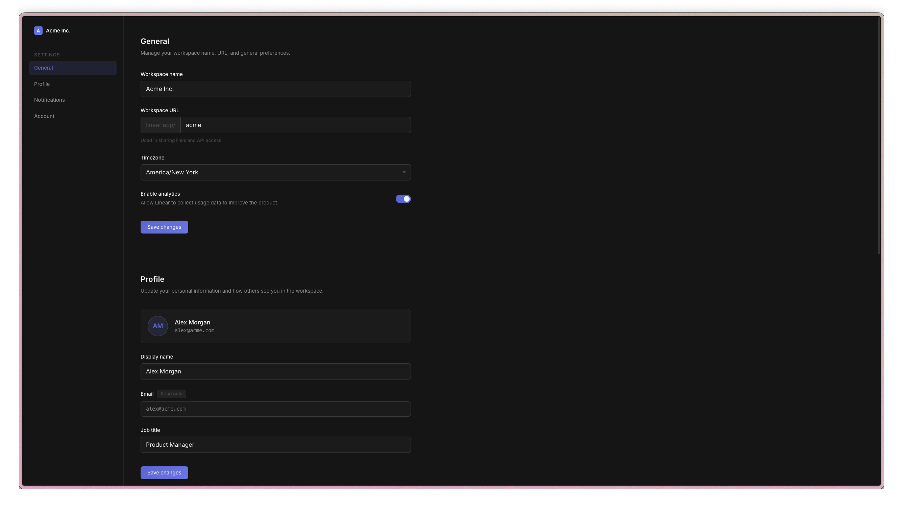
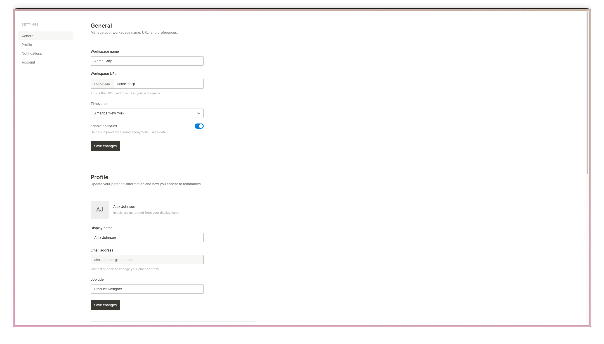

# Examples

Each example in this directory was built by running `claytone init` to inject design guardrails from a preset, then giving an AI agent the same prompt to build a settings page.

The same prompt was used across all examples:

> Build a settings page using React and Vite.
>
> The page has a two-column layout: a fixed left sidebar with navigation links and a main content area on the right.
>
> The sidebar has four navigation items: **General**, **Profile**, **Notifications**, and **Account**. The active item should be visually distinguished. Clicking each item scrolls to or shows that section.
>
> The main content area has four sections, each separated clearly with a title and a short description:
>
> **General** — workspace name, workspace URL (with domain prefix), timezone dropdown, analytics toggle, save button
>
> **Profile** — initials-based avatar, display name, read-only email, job title, save button
>
> **Notifications** — four rows (Product updates, Security alerts, Weekly digest, Member activity), each with a label, description, and toggle
>
> **Account** — read-only current plan, billing button, danger zone with a "Delete workspace" button
>
> Use realistic placeholder content. Toggles toggle, active nav highlights. No real backend needed.

The point is not what was built — it's how differently each preset shapes the final result despite identical instructions.

---

## Linear

Preset: `linear`

Enforces Linear's design language: dark backgrounds, compact density, purple accent (`#5E6AD2`), and Inter as the system font.

---

## Notion

Preset: `notion`

Enforces Notion's design language: light surfaces, generous whitespace, neutral tones, and a document-first layout feel.

